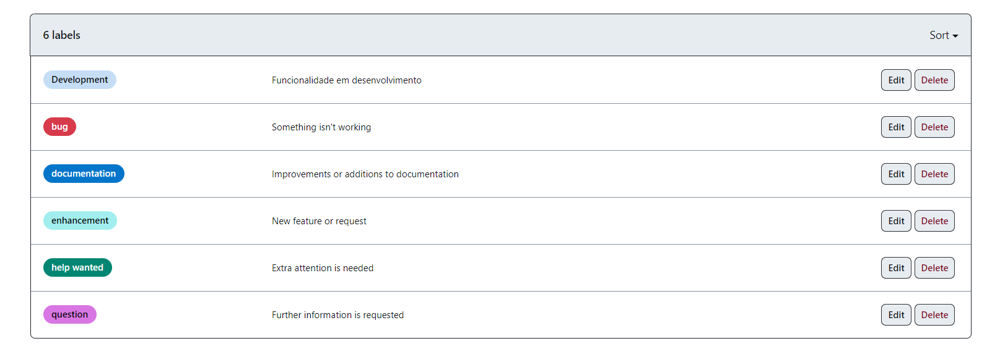

# Metodologia

Pré-requisitos: <a href="2-Especificação do Projeto.md"> Documentação de Especificação</a>

Descreva aqui a metodologia de trabalho do grupo para atacar o problema. Definições sobre os ambiente de trabalho utilizados pela  equipe para desenvolver o projeto. Abrange a relação de ambientes utilizados, a estrutura para gestão do código fonte, além da definição do processo e ferramenta através dos quais a equipe se organiza (Gestão de Times).

## Relação de Ambientes de Trabalho

Os artefatos do projeto são desenvolvidos a partir de diversas plataformas e a relação dos ambientes com seu respectivo propósito é apresentada na tabela que se segue.  

| Ambiente  | Plataforma | Link de Acesso | 
| ------------------- | ----------------|---------------|
|  Repositório de código fonte |  GitHub |  [Reciclai / GitHub / Códigos  ](https://github.com/ICEI-PUC-Minas-PMV-ADS/pmv-ads-2023-2-e4-proj-dad-t2-reciclai)            |
|  Documentos do projeto | GitHub |[Reciclai / GitHub / Documentos  ](https://github.com/ICEI-PUC-Minas-PMV-ADS/pmv-ads-2023-2-e4-proj-dad-t2-reciclai)                     | 
|  Projeto de Interface e Wireframes | Figma | [Reciclai / Figma / Protótipo   ](https://www.figma.com/files/team/1280675660231524054)         |
|  Gerenciamento do Projeto |GitHub | [Reciclai / GitHub / Gerenciamento de Projeto  ](https://github.com/ICEI-PUC-Minas-PMV-ADS/pmv-ads-2023-2-e4-proj-dad-t2-reciclai)                  |

## Controle de Versão

A ferramenta de controle de versão adotada no projeto foi o
[Git](https://git-scm.com/), sendo que o [Github](https://github.com)
foi utilizado para hospedagem do repositório.

O projeto segue a seguinte convenção para o nome de branches:

- `main`: versão estável já testada do software
- `unstable`: versão já testada do software, porém instável
- `testing`: versão em testes do software
- `dev`: versão de desenvolvimento do software

Quanto à gerência de issues, o projeto adota a seguinte convenção para
etiquetas:

- `bug`: uma funcionalidade encontra-se com problemas
- `development`: funcionalidade em desenvolvimento
- `documentation`: melhorias ou acréscimos à documentação
- `enhancement`: uma funcionalidade precisa ser melhorada
- `help wanted`: é necessário atenção extra
- `question` : quando há dúvidas sobre o processo.

## Gerenciamento de Projeto

### Divisão de Papéis

A equipe utiliza metodologias ágeis, tendo escolhido o Scrum como base para definição do processo de desenvolvimento. 

A equipe está organizada da seguinte maneira:

**Scrum Master:** Cláudia Carapiá

**Product Owner:** Carolina Laurindo

**Equipe de Desenvolvimento:** 
- Carolina Laurindo,
- Cláudia Carapiá, 
- Douglas Raynner, 
- Jeferson Queiroz,
- Karen Noguti

**Equipe de Design:** 
- Douglas Raynner

### Processo

Coloque  informações sobre detalhes da implementação do Scrum seguido pelo grupo. O grupo deverá fazer uso do recurso de gerenciamento de projeto oferecido pelo GitHub, que permite acompanhar o andamento do projeto, a execução das tarefas e o status de desenvolvimento da solução.
 
> **Links Úteis**:
> - [Planejamento e Gestáo Ágil de Projetos](https://pucminas.instructure.com/courses/87878/pages/unidade-2-tema-2-utilizacao-de-ferramentas-para-controle-de-versoes-de-software)
> - [Sobre quadros de projeto](https://docs.github.com/pt/issues/organizing-your-work-with-project-boards/managing-project-boards/about-project-boards)
> - [Project management, made simple](https://github.com/features/project-management/)
> - [Sobre quadros de projeto](https://docs.github.com/pt/github/managing-your-work-on-github/about-project-boards)
> - [Como criar Backlogs no Github](https://www.youtube.com/watch?v=RXEy6CFu9Hk)
> - [Tutorial Slack](https://slack.com/intl/en-br/)

### Ferramentas

As ferramentas empregadas no projeto são:

- Editor de código.
- Ferramentas de comunicação
- Ferramentas de desenho de tela (_wireframing_)

O editor de código foi escolhido porque ele possui uma integração com o sistema de versão. As ferramentas de comunicação utilizadas possuem integração semelhante e por isso foram selecionadas. Por fim, para criar diagramas utilizamos essa ferramenta por melhor captar as necessidades da nossa solução.

Liste quais ferramentas foram empregadas no desenvolvimento do projeto, justificando a escolha delas, sempre que possível.
 
> **Possíveis Ferramentas que auxiliarão no gerenciamento**: 
> - [Slack](https://slack.com/)
> - [Github](https://github.com/)
