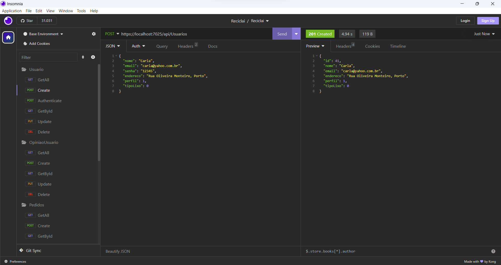
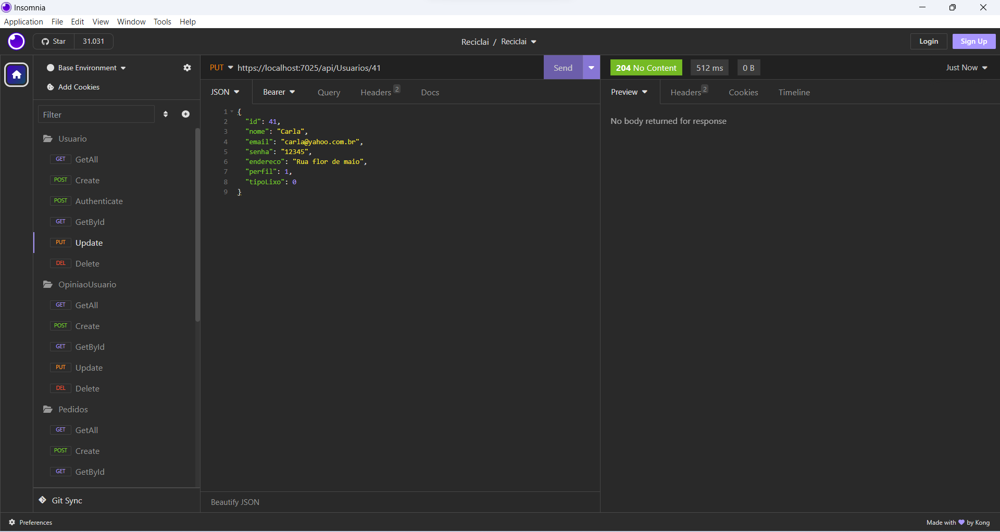
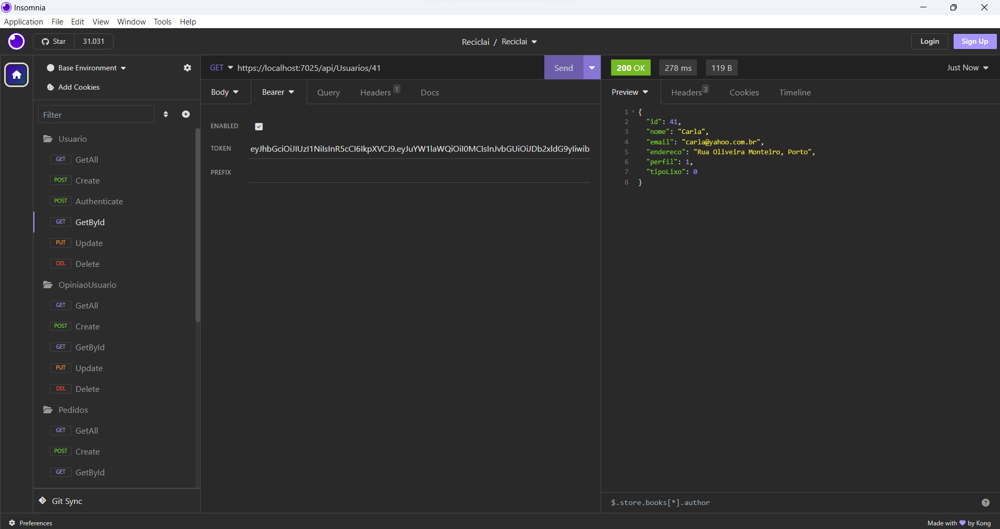
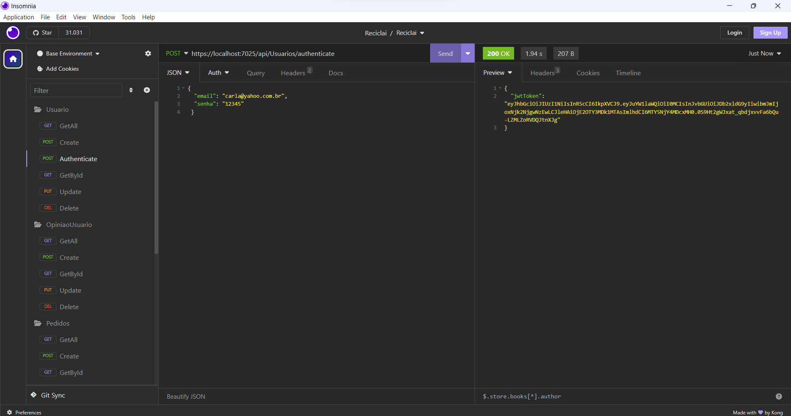
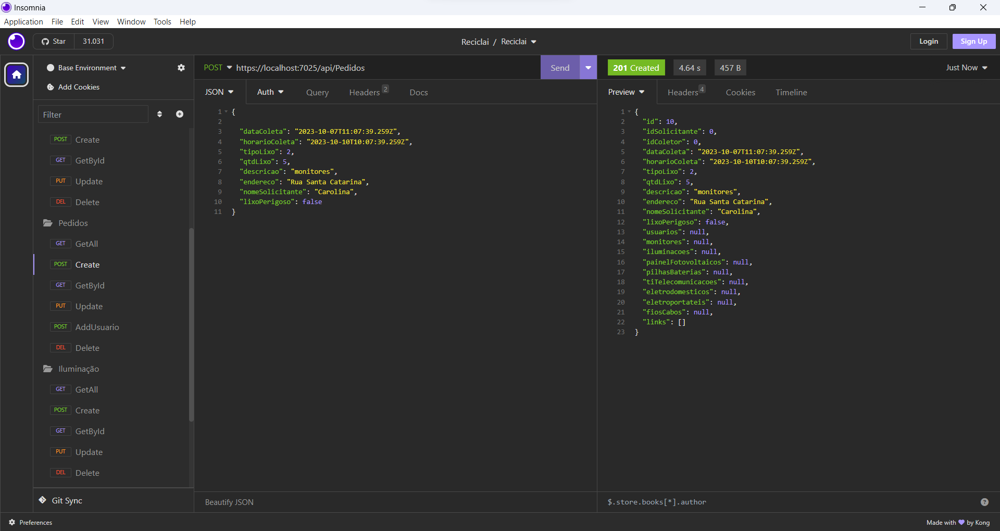
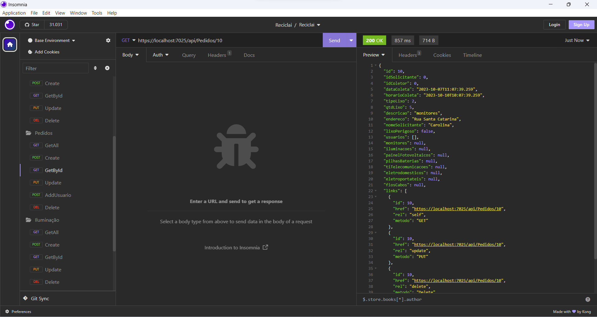
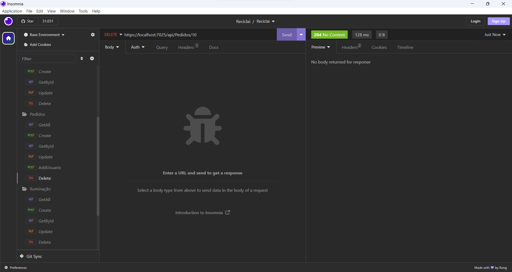

# Registro de Testes de Software

Relatório com as evidências dos testes de software realizados no sistema pela equipe, baseado em um plano de testes pré-definido.

**Caso de Teste 01 - Cadastro de Usuário**

**Caso de Teste 02 - Editar Cadastro de Usuário**

**Caso de Teste 03 - Apagar Cadastro de Usuário**

**Caso de Teste 04 - Login do Usuário**

**Caso de Teste 08 - Cadastro de Pedido**

**Caso de Teste 09 - Editar Pedido**

**Caso de Teste 10 - GetById Cadastro de Pedido**

**Caso de Teste 11 - Apagar Cadastro de Pedido**

## Avaliação

Discorra sobre os resultados do teste. Ressaltando pontos fortes e fracos identificados na solução. Comente como o grupo pretende atacar esses pontos nas próximas iterações. Apresente as falhas detectadas e as melhorias geradas a partir dos resultados obtidos nos testes.

> **Links Úteis**:
> - [Ferramentas de Test para Java Script](https://geekflare.com/javascript-unit-testing/)
