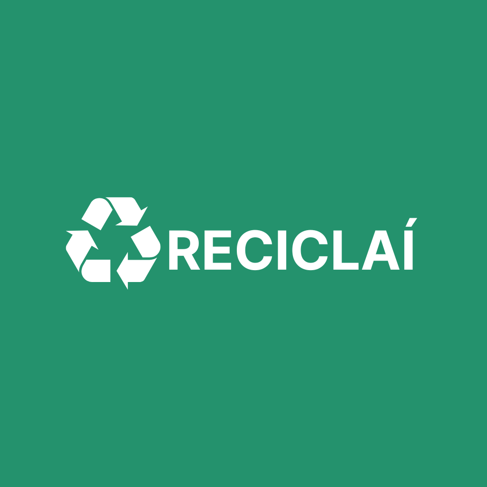

# Apresentação

Assista ao vídeo clicando aqui.

## Título do Projeto

**Reciclaí**

## Identidade Visual (Marca, Design)

### Logotipo

### Paleta de cores

O grupo fez um estudo de cores e escolheu a paleta de cores abaixo para utilizar no projeto:

## Conjunto de Slides (Estrutura)

Acesse os slides clicando [aqui](https://github.com/ICEI-PUC-Minas-PMV-ADS/pmv-ads-2023-2-e4-proj-dad-t2-reciclai/blob/main/presentation/Reciclai_slides_apresentacao_final.pdf)
